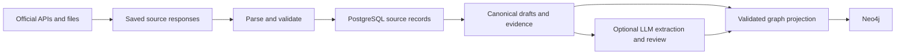

# Build the Jobtology ingestion pipeline in Apache Hop

Already comfortable with Hop? Use the [real-data migration guide](hop-real-data-guide.md) for
the actual API requests, complete field mappings, PostgreSQL loading SQL, Neo4j projection and
comparison against the current pipeline. This page remains the beginner/setup reference.

This is a manual implementation guide for someone who has never used Hop. Start with the
offline lessons, then implement the live sources one at a time. The accompanying
[learning kit](hop-lab/) supplies Docker configuration, two synthetic responses, and learning
tables. You build and save the visual pipelines yourself.

The intended flow is:



This guide adds a learning path, not an implemented replacement for the Python pipeline.
The early exercises deliberately use simpler tables. Do not connect those exercises to the
existing corpus database or treat their output as a published recommendation dataset.

The design uses native Hop transforms and workflow actions. Database DDL, SQL queries, JSONPath,
regular expressions, and graph metadata are configuration you will still author. There are no
Python, JavaScript, or shell actions inside the ETL. Terminal commands below set up the lab.

Quick navigation:

- [Start Docker](#3-start-the-isolated-docker-lab)
- [First PostgreSQL pipeline](#4-lesson-one-two-organizations-into-postgresql)
- [Workflow and unattended runner](#5-lesson-two-a-workflow-and-docker-execution)
- [First Neo4j pipeline](#6-lesson-three-load-neo4j-from-postgresql)
- [First live API](#7-first-real-source-alio-organizations)
- [Remaining sources](#8-implement-the-other-sources-in-dependency-order)
- [Real records and evidence](#9-move-from-learning-tables-to-real-records-and-evidence)
- [LLM extraction](#10-add-the-planned-llm-extraction-stage)
- [Scheduling and cutover](#12-schedule-compare-and-cut-over)
- [Troubleshooting](#13-troubleshooting)

## 1. Your learning route

| Milestone | What you build | Done when |
|---|---|---|
| A | Docker lab and Hop project | The browser editor opens and saves files persistently |
| B | Sample JSON → cleaned rows → PostgreSQL | Two organizations load; rerunning keeps two |
| C | A workflow and unattended execution | The saved workflow runs with the Docker runner |
| D | PostgreSQL → Neo4j | Two organization nodes load without duplicates |
| E | Live ALIO collection | One-page smoke test, then a verified complete snapshot |
| F | Remaining five sources | Identities, dependencies, nulls, and completeness match expectations |
| G | Canonical records, history, and evidence | A source run can be traced and replayed reliably |
| H | LLM extraction and recurring execution | Outputs are validated; failures can retry safely |

Do A–D before spending API quota. E–H are the migration work; they will take more design and
testing than the first exercises. The current implementation is a reference for source behavior,
even if you choose a different physical database layout.

## 2. The few Hop concepts you need first

| Term | Meaning in this project |
|---|---|
| **Project** | Folder containing pipelines, workflows, metadata, and project settings |
| **Pipeline** (`.hpl`) | Reads rows, transforms them, and writes results |
| **Transform** | One operation, such as JSON Input, Filter Rows, or Insert / Update |
| **Hop** | An arrow; in a pipeline it carries rows between transforms |
| **Workflow** (`.hwf`) | Coordinates stages and branches on success/failure |
| **Action** | A workflow operation, such as running a pipeline |
| **Metadata** | Reusable database connections, graph models, and run configurations |
| **Variable / parameter** | Named configuration, such as a connection hostname or source ID |
| **Run configuration** | Selects the engine on which a pipeline or workflow executes |

Pipeline transforms run concurrently as rows flow through them. Use workflow actions to enforce
stage order: fetching must finish before validating a complete snapshot, for example. Avoid
designing a circular arrow in a pipeline to implement pagination.

Hop Web is the browser editor. The `apache/hop` image runs saved work without that editor.
“Local” execution in Hop Web means **inside its container**, not on your laptop. A separate
Hop Server is optional; you do not need it for these lessons.

References: [Hop concepts](https://hop.apache.org/manual/latest/concepts.html),
[creating pipelines](https://hop.apache.org/manual/latest/getting-started/hop-gui-pipelines.html),
[Docker execution](https://hop.apache.org/tech-manual/2.18.1/docker-container.html).

## 3. Start the isolated Docker lab

### 3.1 Copy the kit

Requirements: Docker Engine with Compose, a browser, and enough spare memory for the editor and
databases. Allow roughly 4 GiB available memory for this small lab, especially with Neo4j enabled;
this is a planning allowance, not a measured production requirement.

From the root of this repository:

```bash
docker compose version
mkdir -p "$HOME/Work/jobtology-hop-lab"
cp -R docs/hop-lab/. "$HOME/Work/jobtology-hop-lab/"
cd "$HOME/Work/jobtology-hop-lab"
cp .env.example .env
chmod 600 .env
```

Use a new empty directory for your first copy. Edit `.env` and replace the two example passwords.
Leave both API keys empty for now. All subsequent `docker compose` commands in this guide run
from this copied lab directory, unless explicitly stated otherwise.

The kit selects Hop **2.19.0** for both images, PostgreSQL 17 for the learning database, and
Neo4j 5.26 Community for the optional graph exercise. These are lab choices, not instructions to
change the application's PostgreSQL version. Hop image tags were checked on 2026-09-08; keep
editor and runner versions aligned. Online `latest` manuals may change after this guide.

### 3.2 Initialize the project volume and start the editor

```bash
docker compose config --quiet
docker compose pull postgres hop-web
docker compose run --rm --no-deps --user 0 --entrypoint /bin/sh hop-web -c \
  'mkdir -p /files/jobtology/pipelines /files/jobtology/workflows /files/jobtology/metadata /files/jobtology/prompts /files/jobtology/datasets /files/raw /files/audit && chown -R 501:501 /files'
docker compose up -d postgres hop-web
docker compose logs --tail=80 hop-web
```

The initialization command grants the Hop image's user access to the new lab volume. Run it only
against this lab; it is not a permissions repair command for your existing corpus storage.

Open **http://127.0.0.1:18080/ui**. Allow time for the initial application startup.
The supplied Compose file binds the editor to loopback. On a remote host, use an SSH tunnel
instead of making this learning UI public:

```bash
ssh -L 18080:127.0.0.1:18080 your-server
```

The editor initially opens its default project. Use the project creation control next to the
project selector (at the top of the editor) and set:

- Name: `jobtology-hop-lab`
- Home: `/files/jobtology`
- Configuration file: `project-config.json`
- Metadata directory: `${PROJECT_HOME}/metadata`

Save and select the project. If startup fails, use the troubleshooting table at the end.
On later starts, select this saved project rather than creating another one. The runner will
register the same saved project in its own temporary configuration when you reach lesson two.

### 3.3 Understand what gets saved

| Location inside the container | Storage | Contents |
|---|---|---|
| `/files/jobtology` | `hop-files` named volume | Your saved ETL project |
| `/files/raw` | Same lab volume | Later raw-response exercises |
| `/files/audit` | Same lab volume | Editor audit/UI state |
| `/usr/local/tomcat/webapps/ROOT/config` | `hop-web-config` volume | Editor configuration and registrations |
| `/fixtures` | Read-only mount of the kit's `fixtures/` | Synthetic tutorial responses |
| `/jdbc` | Read-only mount of `jdbc/` | Optional extra JDBC drivers |
| PostgreSQL and Neo4j data directories | Separate named volumes | Database contents |

Saving in the editor writes to these container paths. A browser file dialog is not browsing
your laptop's filesystem. The project does not require a Git repository to execute.

`docker compose stop` stops the lab. `docker compose up -d postgres hop-web` starts it again.
`docker compose down` removes its containers while retaining named volumes. **Do not add `-v`
unless you intend to delete the lab's saved project and databases.**

For a project export, save your open files and run:

```bash
docker compose cp hop-web:/files/jobtology ./project-backup
```

Use a fresh export destination on subsequent backups. Git can track exported project definitions
or a host directory you later bind-mount. Keep credentials and raw/provider data outside Git.
Backing up the project does not back up PostgreSQL, Neo4j, or raw-response history.

References: [Hop Web](https://hop.apache.org/manual/latest/hop-gui/hop-web.html),
[Docker persistence guidance](https://hop.apache.org/manual/next/hop-web-docker.html).
The latter is development documentation; the lab mounts the existing configuration path to avoid
depending on newer authentication/bootstrap options.

## 4. Lesson one: two organizations into PostgreSQL

### 4.1 Create a database connection

In the Metadata perspective/tree, create a **Relational Database Connection**. You can also
create one from the connection selector in a database transform.

| Setting | Value |
|---|---|
| Name | `jobtology_lab_pg` |
| Database type | PostgreSQL |
| Access | Native / JDBC |
| Host | `${HOP_PG_HOST}` |
| Port | `${HOP_PG_PORT}` |
| Database | `${HOP_PG_DATABASE}` |
| Username | `${HOP_PG_USER}` |
| Password | `${HOP_PG_PASSWORD}` |

Use **Test**, then save. Compose provides those environment variables to both editor and runner.
The effective host is `postgres`, port `5432`. Do not paste the application's SQLAlchemy DSN
or use `127.0.0.1:55432`: those describe access from the host, not this container network.

If the PostgreSQL driver is missing, put the official PostgreSQL JDBC jar in the lab's `jdbc/`
directory and recreate the editor. The kit exposes the same directory to the runner. Do not
download a driver merely because the database test reports a password or hostname error.

Reference: [database connection metadata](https://hop.apache.org/manual/latest/metadata-types/rdbms-connection.html).

### 4.2 Create and save a pipeline

Use **File → New → Pipeline**, then save it as:

```text
/files/jobtology/pipelines/01_alio_fixture.hpl
```

Click the blank canvas and search for transforms by name. Add and connect these:

```text
JSON Input → String operations → Select values → Add constants → Data Validator → Insert / Update
```

To connect two transforms, click the first, choose **Create hop**, then click the second.
Double-click a transform to edit it. Give each a descriptive instance name, such as
`read_fixture` or `save_organizations`.

### 4.3 Read the sample JSON

Configure **JSON Input** to read a file, with filename `/fixtures/alio-sample.json`.
Add the filename to its input list. In the Fields tab, enter:

| Output field | JSONPath | Hop type |
|---|---|---|
| `organization_code` | `$.result[*].instCd` | String |
| `organization_name` | `$.result[*].instNm` | String |
| `organization_type` | `$.result[*].instTypeNm` | String |
| `website` | `$.result[*].siteUrl` | String |
| `established_date` | `$.result[*].fndnYmd` | String |

Keep null values. For later optional fields, use the missing-leaf-to-null option; a missing
required identity must still fail validation. Avoid enabling broad “ignore errors” options.

Select this transform and use **Preview** from its context menu or the preview toolbar control.
Choose the local Hop engine; if there is no pipeline run configuration, create one named `local`
with the Hop local engine. Preview should show **two** rows, including a null website for `LAB002`.
The spaces around `실습기관 하나` are intentional.

During this first preview, temporarily leave downstream transforms disconnected or disabled.
Preview is execution: once a database or API operation is on the executed path, it can perform
that operation. Repeated previews of a live API pipeline consume quota.

Reference: [JSON Input](https://hop.apache.org/manual/latest/pipeline/transforms/jsoninput.html).

### 4.4 Clean, type, and validate

Configure the remaining transforms:

1. **String operations:** trim both ends of `organization_code` and `organization_name`.
2. **Select values:** in the metadata/type conversion tab, convert `established_date` to Date
   with input format `yyyyMMdd`. Keep the other fields as String. Disable lenient date parsing
   if that option is present. IDs remain strings even if they contain only digits.
3. **Add constants:** add `source_id`, type String, value `alio_organization`.
4. **Data Validator:** require `organization_code` and `organization_name` to be non-null and
   at least one character long. Do not require `website`.

Connect the transforms and preview the validator output. Expect trimmed names and two dates.
These teaching fields mirror a subset of
[`normalize()`](../src/jobtology_db/processing/sources.py); full organization processing also
retains government code, supervising organization code, address, and field provenance.

### 4.5 Save the rows and prove replay works

Configure **Insert / Update**:

- Connection: `jobtology_lab_pg`
- Schema: `hop_lab`
- Table: `organization`
- Lookup keys: table `source_id` = stream `source_id`; table `organization_code` = stream
  `organization_code`
- Update fields: `organization_name`, `organization_type`, `website`, `established_date`, each
  mapped to its same-named stream field
- One transform copy; commit size `100` is sufficient for this exercise

The table already exists: `init.sql` initializes only the new lab database. Do not ask Hop to
drop/recreate tables. Save, press the run button, and select the local pipeline configuration.

Inspect the result from the lab terminal:

```bash
docker compose exec postgres psql -U hop_lab -d jobtology_hop_lab \
  -c 'SELECT * FROM hop_lab.organization ORDER BY organization_code;'
```

Expect `LAB001` and `LAB002`. Run the pipeline again; expect the same two rows. This demonstrates
key-based loading. It does **not** implement immutable revisions or a complete-snapshot release.

Reference: [Insert / Update](https://hop.apache.org/manual/latest/pipeline/transforms/insertupdate.html).

### 4.6 Add a rejection path

Add **Table Output**, using `hop_lab.rejected_organization`. From the Data Validator context
menu, choose **Error handling** and direct errors to this transform. Configure the error
description output field as `error_description`. In Table Output, explicitly map only:

- `organization_code`
- `organization_name`
- `error_description`

The database supplies `rejected_id` and `rejected_at`. Leave the validator's normal output
connected to Insert / Update. Switch JSON Input to `/fixtures/alio-invalid.json` and run once.

```bash
docker compose exec postgres psql -U hop_lab -d jobtology_hop_lab \
  -c 'SELECT organization_code, error_description FROM hop_lab.rejected_organization ORDER BY rejected_id;'
```

Expect `LAB_BAD` in the rejection table and no `LAB_BAD` organization. Reset the input filename
to `/fixtures/alio-sample.json` and save. Rejections append in this learning table.

A handled error can leave a pipeline technically successful. Later, the workflow must inspect
the **current run's** rejection count and mark that run `REVIEW_REQUIRED`; a green check mark
does not establish acceptable source quality. Add error paths to parsing/date conversion too
when using real data. [Data Validator reference](https://hop.apache.org/manual/latest/pipeline/transforms/validator.html).

## 5. Lesson two: a workflow and Docker execution

Create **File → New → Workflow** and save:

```text
/files/jobtology/workflows/00_lab.hwf
```

Add these actions and connect them:

```text
Start → Pipeline: load sample organizations → Success
                     └─ failure → Abort workflow
```

In the Pipeline action, select `${PROJECT_HOME}/pipelines/01_alio_fixture.hpl` and the `local`
pipeline run configuration. Set the outgoing success/failure conditions using the workflow hop
settings. Workflow arrows express action results; they do not carry organization rows.

Create a **Workflow Run Configuration** named `local` using the local workflow engine if one
does not exist. Pipeline and workflow run configurations are different metadata types and can
both be named `local`. Run the workflow in the editor and save all files.

Now execute the saved workflow in a separate short-lived container:

```bash
docker compose --profile run run --rm hop-runner
```

The runner shares the project volume and connection variables. It should finish and exit
successfully, while the organization table still contains two rows. It does not need an open
browser. This command does not start a scheduler.

The runner and editor have separate application configuration. Shared project metadata is why
the saved connection and both `local` run configurations must live under the project.

References: [Pipeline workflow action](https://hop.apache.org/manual/latest/workflow/actions/pipeline.html),
[Docker runner options](https://hop.apache.org/tech-manual/2.18.1/docker-container.html).

## 6. Lesson three: load Neo4j from PostgreSQL

Start the optional database:

```bash
docker compose --profile graph up -d neo4j
docker compose logs --tail=60 neo4j
```

Create **Neo4j Connection** metadata named `jobtology_lab_neo4j`:

- Connection URI: `${HOP_NEO4J_URI}` (`bolt://neo4j:7687` inside Docker)
- Username: `neo4j`
- Password: `${HOP_NEO4J_PASSWORD}`
- Database: `neo4j`

Create **Neo4j Graph Model** metadata named `lab_organizations`. Add a node with label
`LabOrganization`, primary property `id` (String), and ordinary properties `name` and `source_id`.
Mark/index the primary property as appropriate in the model editor.

Create `pipelines/02_organizations_to_neo4j.hpl`:

```text
Table Input → Neo4j Graph Output
```

In Table Input, choose `jobtology_lab_pg` and enter:

```sql
SELECT source_id || ':' || organization_code AS id,
       organization_name AS name,
       source_id
FROM hop_lab.organization
ORDER BY source_id, organization_code;
```

In Graph Output, choose the Neo4j connection and model. Map stream `id`, `name`, and `source_id`
to the corresponding node properties. Enable model/index validation and create the model's
required indexes using its provided controls. Keep one transform copy while learning.

Run once, then run again. Open **http://127.0.0.1:17474** in your browser. If Neo4j Browser asks
for a connection URI, use `bolt://127.0.0.1:17687` with the lab credentials. Query:

```cypher
MATCH (o:LabOrganization)
RETURN o.id, o.name
ORDER BY o.id;
```

There should still be two nodes. Add this pipeline as a second Pipeline action in `00_lab.hwf`,
after the PostgreSQL load, once this lesson succeeds. Start Neo4j before running that workflow.

When you later have postings, define `LabJobPosting` with a stable source-qualified ID and
connect it to `LabOrganization` through an `EMPLOYER` relationship. Match by official institution
code. Similar names are not sufficient evidence that two organizations are identical.

The application's current graph loader uses `IngestBatch`, `IngestRecord`, and `IngestIdentity`.
These `Lab*` labels are a teaching projection, not a compatible replacement. PostgreSQL remains
the record authority; graph loading is a separately retriable stage. There is no single transaction
covering both databases.

References: [Neo4j Connection](https://hop.apache.org/manual/latest/metadata-types/neo4j/neo4j-connection.html),
[Graph Model](https://hop.apache.org/manual/latest/metadata-types/neo4j/neo4j-graphmodel.html),
[Graph Output](https://hop.apache.org/manual/latest/pipeline/transforms/neo4j-graphoutput.html).

## 7. First real source: ALIO organizations

### 7.1 Fetch one page first

The endpoint and fields below come from this repository's connector, inspected on 2026-09-08.
They are not a fresh provider availability check. See [credentials](credentials.md) for API
applications and [source rights](../config/source_rights.yaml) for permitted uses.

Put your issued **decoded/raw** key in the copied lab `.env` as `DATA_GO_KR_SERVICE_KEY`, then
recreate the editor so it receives the environment change:

```bash
docker compose up -d --force-recreate hop-web
```

Create `pipelines/10_alio_fetch_one_page.hpl`:

```text
Generate Rows → Get variables → REST Client → Select values
  → Filter Rows → JSON Input → Filter Rows → Dummy
```

Configure **Generate Rows** to emit exactly one row with `page_no` = 1 (Integer), `page_size` =
100 (Integer), and `result_type` = `json` (String). Configure **Get variables** to add
`service_key` from `${DATA_GO_KR_SERVICE_KEY}`.

In REST Client, use GET and the fixed URL:

```text
https://apis.data.go.kr/1051000/public_inst/list
```

Leave automatic pagination off. Configure output fields `response_body` and `http_status`;
set connect/read timeouts to 10000/60000 ms, and keep certificate verification enabled.
The Query Parameters tab maps **incoming fields** to API parameter names:

| Incoming field | Parameter |
|---|---|
| `service_key` | `serviceKey` |
| `page_no` | `pageNo` |
| `page_size` | `numOfRows` |
| `result_type` | `resultType` |

Do not pre-encode the key or put it in the saved URL. Keep log level Basic; before using real
credentials, check logging/error behavior with a dummy key. Arbitrary query keys and row previews
must not be assumed to receive automatic credential redaction. Remove `service_key` from the
stream as soon as the request is finished: in the Select values transform immediately after
REST Client, use the Remove tab to remove `service_key` before saving or previewing downstream data.

The first Filter Rows accepts HTTP 200. Its false branch goes to an **Abort** transform.
JSON Input reads from the incoming `response_body` field and extracts the envelope:

| Field | JSONPath | Type |
|---|---|---|
| `provider_result` | `$.resultCode` | String |
| `total_count` | `$.totalCount` | Integer |
| `response_page` | `$.pageNo` | Integer |

The second filter requires `provider_result = "200"`. Also require nonnegative total count
and the returned page to match the request. HTTP 200 can contain an API error. Only then add a
second JSON Input reading `response_body`, using the organization field mappings from lesson one.
The terminal Dummy transform lets you inspect parsed rows without database writes.

For nested JSON, first extracting one object per row and then its individual fields avoids
misaligning optional fields. Always preview a record with a null/missing field before loading.

For this source, one response is a **smoke test**. It is not the complete institution list.

Reference: [REST Client configuration](https://hop.apache.org/manual/latest/pipeline/transforms/rest.html).

### 7.2 Save source responses before normalizing them

Separate live fetching from offline processing. Implement a fetch workflow that saves every
response and request observation, then a processing workflow that reads only those saved inputs.
That allows a mapping fix to be tested without fetching the provider again.

Create new lab tables for runs and observations before expanding the fetch pipeline. At minimum,
plan for `run_id`, `source_id`, `partition_id`, page number, attempt number, retrieval time, HTTP
status, provider status, raw-file location, and SHA-256. The policy revision belongs on the run.
Store a sanitized endpoint/parameter description; exclude credentials.

Use native binary download/output operations for byte-preserving archival. A parsed JSON object
written back through JSON Output is a new serialization and is not the original response bytes.
Do not label its checksum as the original raw-response hash. If using REST Client's binary mode,
archive the binary field before decoding a separate field for parsing. Test that combination in
the selected Hop version before relying on it.

For the first implementation, unique run/page paths under `/files/raw` are easier to understand
than the existing content-addressed layout. Record this as a deliberate storage change. Preserve
old raw objects and their ledger references if migrating historical data.

### 7.3 Enumerate a complete snapshot

For these declared-total APIs, use a three-stage workflow:

1. **First page:** archive page 1 and its total count. Calculate
   `expected_pages = ceil(total_count / page_size)`.
2. **Remaining pages:** generate request rows numbered 2 through `expected_pages`, then call a
   reusable single-page fetch pipeline once per request row. Do not fetch page 1 twice when
   combining results.
3. **Validate:** read saved observations and records for this run, check coverage, then make the
   run available to processing.

A native way to generate the remaining page numbers is a parameterized **Table Input** query
against the lab PostgreSQL connection. Feed it a one-field row containing `expected_pages`, set
“Insert data from transform” to that incoming transform, and enable execution for each row:

```sql
SELECT page_no
FROM generate_series(2, CAST(? AS integer)) AS pages(page_no);
```

The bound integer comes from validated metadata, not string substitution. For one expected page
the query returns zero rows. Reattach the run/source/partition context with a lookup or child
pipeline parameters. Define child parameters explicitly and map them in **Pipeline Executor**.

Hop also provides REST connection pagination. However, its generic `PAGE_NUMBER` mode stops on
an empty page and has a request cap; stopping is not proof that this repository's declared-total
contract has been satisfied. The explicit request-row approach makes snapshot validation and
per-attempt accounting easier to inspect.

Before declaring the run complete, require:

- Stable declared total and page size across the saved pages.
- Exactly the expected page numbers, with no missing or duplicate pages.
- Correct rows per page and unique source identities across the entire snapshot.
- For total zero, a second independent confirmation of the empty first page.
- Every archive file present and matching its recorded hash/length.
- Zero unresolved fetch failures and no unaccounted rejections.

Use Group By, sorting, lookups/joins, filters, and PostgreSQL queries for these checks. Duplicate
rows should be detected before any Unique Rows transform discards them. A duplicate may signal
that the provider reordered a mutable dataset during collection.

Start with one HTTP execution at a time. The current updater defaults to a per-source rolling
24-hour budget of 1,000 attempts and 0.2 seconds minimum delay; use the applicable approved quota.
Native REST retries may happen inside one transform invocation: an outer row count does not
automatically count all those attempts. For exact accounting, disable internal retries and
record/retry individual attempts in a workflow. Reproduce the current timeout, response-size,
storage-reserve, and redirect/host rules before unattended cutover; verify which can be configured
in the chosen version rather than assuming a generic REST transform implements them all.

References: [Table Input](https://hop.apache.org/manual/latest/pipeline/transforms/tableinput.html),
[Pipeline Executor](https://hop.apache.org/manual/latest/pipeline/transforms/pipeline-executor.html),
[REST connection pagination](https://hop.apache.org/manual/latest/metadata-types/rest-connection.html).

## 8. Implement the other sources in dependency order

Keep one adapter per source. Adapters produce a shared envelope: source ID, source-record ID,
run/document reference, normalized fields, original payload, and quality result. Keep provider
field names at the adapter boundary; downstream graph/extraction pipelines use shared names.

These are the repository's existing request contracts, not a promise that providers never change:

| Source | Endpoint / input | Request shape | Items and identity |
|---|---|---|---|
| `ncs_career_path` | Pinned URL from `.env.example` | Single downloaded CSV | Composite occupation/unit/rank/level row identity |
| `ncs_competency` | `https://c.q-net.or.kr/openapi/Ncs1info/ncsinfo.do` | `serviceKey`, `type=json`, `pageNo`, `numOfRows=1000` | `$.root.items[*]`; full `ncsClCd` |
| `ncs_qualification` | `https://apis.data.go.kr/B490007/ncsClCdJm/getNcsClCdJmList` | `serviceKey`, `dataFormat=json`, `ncsClCd`, `pageNo`, `numOfRows=50` | `$.body.items[*]`; NCS code + `jmCd` + `organStdVerCd` |
| `qnet_schedule` | `https://apis.data.go.kr/B490007/qualExamSchd/getQualExamSchdList` | `serviceKey`, `dataFormat=json`, `implYy`, `jmCd`, `pageNo`, `numOfRows=50` | `$.body.items[*]`; item/year/category/round |
| `alio_organization` | `https://apis.data.go.kr/1051000/public_inst/list` | `serviceKey`, `resultType=json`, `pageNo`, `numOfRows=100` | `$.result[*]`; `instCd` |
| `job_alio` | `https://apis.data.go.kr/1051000/recruitment/list` | `serviceKey`, `resultType=json`, `ongoingYn=Y`, `pageNo`, `numOfRows=100` | `$.result[*]`; `recrutPblntSn` |

NCS competency metadata lives under `$.root.info`; qualification and Q-Net metadata under
`$.body`. Validate each provider's success envelope as well as HTTP status using the actual saved
response and [`connectors/base.py`](../src/jobtology_db/connectors/base.py) as references.
The lowercase `serviceKey` on CQ-Net and the 50-row caps are intentional provider quirks.

### 8.1 NCS career-path CSV

Use CSV File Input or Text File Input after downloading the pinned file. The current parser
accepts UTF-8 with BOM and falls back to CP949; configure the actual file's encoding explicitly.
Check quoted fields and embedded newlines.

Required columns:

```text
대분류코드, 중분류코드, 소분류코드, 직무코드, 직무명,
직무역량코드, 직무역량명, 직무역량수준(능력단위수준 이면서 세분류의 자식),
수준(직급수준), 직급명
```

Build occupation code by padding the first four code components to two digits and concatenating
them. Add the padded two-digit unit component to obtain the unversioned competency code.
Keep original values and record/column locations. CSV logical record numbers are different from
physical line numbers when quoted fields contain newlines.

Do not merge this unversioned unit into a full-version NCS competency merely because its prefix
matches. The monthly job checks the pinned artifact; discovery of a replacement download is a
separate operation.

### 8.2 NCS competency → qualification → Q-Net

Build these as sequential workflow stages:

```text
Complete NCS competency snapshot
  → the 11 allowed MVP subcategories → distinct full versioned ncsClCd values
  → qualification requests for those codes
  → distinct jmCd values from the completed qualification snapshot
  → Q-Net requests for each item × configured year
```

Use validated upstream data to generate partitions. Do not manually maintain thousands of codes
in the canvas. Preserve a full code such as `2001010506_19v3`, including its version suffix.
The exact subcategory allowlist and request-generation SQL are in the
[real-data guide](hop-real-data-guide.md#34-ncs-qualification-mappings-filter-the-request-codes).

Normalization rules to implement:

- NCS `compeUnitLevel=0` becomes null with `UNSPECIFIED_COMPETENCY_LEVEL`; original zero survives.
- A qualification mapping's identity includes `organStdVerCd`; mappings for different standards
  must not overwrite each other.
- Q-Net qualification identity comes from the request `jmCd` when the response omits it.
- Keep year, `qualgbCd`, and `implSeq` in exam-session identity. Preserve written/practical date
  fields and reject reversed date ranges. Missing dates and training hours stay null.
- Default Q-Net scope is the current and following calendar years. Regenerate it after rollover.

### 8.3 JOB-ALIO list and detail

After enumerating list pages, emit one detail request per distinct `recrutPblntSn`:

```text
GET https://apis.data.go.kr/1051000/recruitment/detail
serviceKey=<runtime value>, resultType=json, sn=<posting ID>
```

The detail is an object at `$.result`, not an array at `$.result[*]`. Preserve list and detail
as distinct observations and join them only within the same complete run.

| Canonical input | Provider field |
|---|---|
| Posting ID | `recrutPblntSn` |
| Title | `recrutPbancTtl` |
| Employer identity | `pblntInstCd` |
| Employer text | `instNm` |
| Posted / closing date | `pbancBgngYmd` / `pbancEndYmd` |
| Active status | `ongoingYn` |
| Eligibility / disqualification | `aplyQlfcCn` / `disqlfcRsn` |
| Preference / selection text | `prefCn` / `scrnprcdrMthdExpln` |

Require full list/detail ID coverage. Title, organization code, and posting/closing dates must
agree; reject a conflicting non-null detail status. Null status is unknown. During canonical
assembly, supplied detail values win and list values fill null detail fields. Preserve the
origin of each selected value and both document references.

Keep closing dates as dates; a date field is not an exact deadline timestamp. An absent posting
is not automatically deleted or closed. The current staging implementation retains history and
does not infer serving status from absence.

### 8.4 Scope and cadence

The active source set is **six**. Saramin is rights-blocked/pending and Work24 is post-MVP;
their connector code does not make them eligible for automatic activation.

Match [the current schedule](../config/pipeline.yaml): career paths and organizations every
30 days, NCS competency/qualification every 7 days, Q-Net and JOB-ALIO every 24 hours.
Intervals are measured from successful completion, not fixed midnight jobs. Dependency changes
can make a source due sooner.

## 9. Move from learning tables to real records and evidence

Before replacing any existing writer, choose whether to preserve the current database contracts
or deliberately design a new schema with a documented data migration. The `hop_lab.organization`
upsert example is insufficient for the existing immutable canonical model.

Use [canonical schemas](canonical-schemas.md), [canonical load status](canonical-load-status.md),
and [processing operations](processing-pipeline.md) as the design reference:

| Existing responsibility | Native Hop implementation work |
|---|---|
| Raw response/observation separation | Archive files plus observation/run tables; retain repeat fetch observations |
| Source-shaped normalized records | Source adapters, typed conversions, validation, original payload retention |
| Stable entity identities | Explicit source-qualified keys and reviewed cross-source mappings |
| Immutable revisions | Append changed revisions; do not mutate previous revisions with Insert / Update |
| Canonical input/output membership | Persist document, observation, revision, and run relationships |
| Grounding | Text blocks, field locations, evidence references, and validation |
| Processing checkpoints | Persist document/item completion only with its successful database writes |
| Graph checkpoints | Load a specified accepted batch; verify membership before declaring graph success |

Keep ingestion, processing, canonical draft, and publication states separate. Today the updater
automatically stops at staging; canonical assembly is an explicit step; final requirement
publication and the serving graph are still future work.

Several decisions deserve an explicit prototype rather than a checkbox assumption:

1. **Atomicity:** separate Table Output transforms with independent connections/commits do not
   create one document transaction. Use a tested shared-transaction design or a PostgreSQL
   transaction through a native SQL action. Never commit the checkpoint before the record set.
2. **Hash compatibility:** the current IDs use sorted compact JSON encoded as UTF-8. A hash of
   arbitrary Hop JSON output will not necessarily match. Preserve the encoding exactly, or
   version and migrate identities and their references together.
3. **Unicode evidence:** current text is NFC/LF normalized, with zero-based half-open Unicode
   code-point offsets. Java string positions can differ for supplementary characters. Verify
   normalization and substring semantics, including Korean decomposed text and emoji, before
   claiming compatibility. A possible SQL-assisted design is PostgreSQL `normalize(text, NFC)`
   and character-based substring checks on a UTF-8 database, tested against the existing fixtures.
4. **Acceptance:** Data Validator checks field rules; it does not recreate the nested and
   cross-record validators in `CanonicalBundle` or `ExtractionOutput`. Explicitly implement
   reference validity, group cycles, evidence consistency, and unresolved-value rules.

Keep advanced cases in DRAFT/review until those checks exist. If a required invariant becomes
unwieldy with native transforms and SQL, record the gap before deciding whether to simplify the
contract or permit a narrowly scoped custom component. This guide does not claim that strict
native-only parity with every Python guarantee has already been demonstrated.

## 10. Add the planned LLM extraction stage

The LLM stage is future work in both the existing implementation and this guide. Start with
saved mock responses, then enable a small live batch after validating the request/response path.

Build a reusable child pipeline:

```text
Read candidate documents → Check extraction cache → Prepare model request
  → Language Model Chat or REST Client → Save raw result and metadata
  → JSON Input → Validate candidates/evidence → Save extraction draft
```

Use **Language Model Chat** when its provider options cover your needs. It has a mock mode.
Use native **REST Client** for provider-specific structured-output schema settings that are not
exposed by the model transform. Its JSON chat envelope option alone does not guarantee schema
enforcement. [Language Model Chat reference](https://hop.apache.org/manual/latest/pipeline/transforms/languagemodelchat.html).

Keep these project artifacts together:

```text
prompts/requirements-v1.txt
prompts/requirements-v1.schema.json
datasets/extraction-inputs.json
datasets/extraction-expected.json
pipelines/50_extract_requirements.hpl
pipelines/51_validate_extraction.hpl
```

The current [`ExtractionOutput`](../src/jobtology_db/contracts/requirements.py) has `candidates`
and `groups`. Candidates preserve kind, mention, necessity, polarity, applicability text, and
evidence selectors. Groups preserve `ALL_OF`/`ANY_OF`; “Python OR Java” must remain an alternative.
The model does not assign canonical IDs or acceptance status.

You can export the current schema once from the original repository for use as a design artifact:

```bash
# Run in the original Jobtology-DB directory, not the copied Docker lab.
uv run jobtology schema show extraction-output > /tmp/jobtology-extraction-output.schema.json
```

Copy/adapt it into the Hop project through your file workflow. A provider may support only a
subset of JSON Schema, so verify its current API documentation and schema restrictions before
configuring the live request. Avoid putting model-version assumptions in every source adapter.

For a REST implementation, construct requests with JSON Output/other native JSON transforms,
including proper string escaping for Korean text, quotes, and newlines. Confirm the output has
the provider's required object/array shape; a JSON-looking text field can otherwise become a
quoted string or an unwanted wrapper. Send the JSON field as the request body and read only the
provider's structured result field into the extraction parser.

Use these initial acceptance exercises:

- Explicit degree requirement → an education candidate with matching source evidence.
- No degree requirement stated → no invented requirement.
- Preferred credential → `PREFERRED`, not `REQUIRED`.
- Negation and exclusion → retained polarity/applicability.
- Alternative skills → an `ANY_OF` group, not two mandatory requirements.
- Unsupported excerpt, malformed output, refusal, or truncation → review/retry path, no accepted claim.

Cache by document text hash **and** extractor/prompt/schema/model configuration. Record requested
and returned model, response ID, token usage, raw output, and source document reference. Preserve
source-supplied facts; extracted values get their own origin and review state. If information is
absent, it remains unknown. Date arithmetic and eligibility decisions remain deterministic.

Use a small explicit per-run call limit and one concurrent request initially. Save successful
extractions so a downstream database or graph retry does not need another paid request. A network
timeout may occur after a provider processed a request; a retry can still incur another charge.

## 11. Add more sources without duplicating the whole flow

For each new source:

1. Record its permission, authentication, pagination, quota, and refresh contract.
2. Build its fetch adapter and save a representative raw fixture.
3. Build its parser into the shared source/document/canonical draft format.
4. Define source-qualified identities and cross-source resolution rules.
5. Reuse the common validation, extraction, persistence, and graph workflows.
6. Test empty input, optional fields, duplicates, provider errors, and replay before scheduling.

A new provider of job postings should not require a new posting schema for every field spelling.
A genuinely new entity type may require extending the canonical and graph models. HTML/PDF/OCR
sources also need a text-extraction adapter; their layout and evidence locations need their own tests.

Native child pipelines can take fields/parameters such as `SOURCE_ID`, `RUN_ID`, `DOCUMENT_ID`,
and parser version. Define those parameters in each child rather than relying on implicit global
variables. Avoid setting a variable and consuming it elsewhere in the same concurrent pipeline.

## 12. Schedule, compare, and cut over

### 12.1 Build a persisted update workflow

The final update workflow should read due-source state from PostgreSQL, acquire one updater
lock/lease, and execute source workflows in dependency order. Mark success only after the
required stage validates; record failures and the next retry time. Current retry backoff defaults
to one hour. An unrelated source should still be able to run when another fails.

A plain Hop success flag or container restart policy is not a substitute for the current
`control.source_sync` behavior. Failed fetch enumeration starts a new complete fetch; interrupted
processing can replay saved complete inputs. Do not combine pages from separate mutable snapshots.

If using a PostgreSQL advisory lock, it must remain held on the same live session throughout the
protected operation. A short SQL action that closes its connection releases the lock. A persisted
lease needs atomic acquisition, expiry, and renewal. Implement and test one design before enabling
multiple triggers.

Use Coolify's scheduled task/cron mechanism to invoke the runner periodically, for example every
15 minutes, while the workflow itself decides which sources are due. The lab execution command is:

```bash
docker compose --profile run run --rm hop-runner
```

Replace `HOP_FILE_PATH` with your completed updater workflow when ready. Do not put the runner
on `restart: always`: a successful one-shot run should exit. A scheduler starts the next invocation.

### 12.2 Compare saved snapshots before switching writers

Use the **same complete saved inputs** for both implementations. Compare results in separate
databases/schemas so the comparison cannot modify the existing corpus. The reports below are a
historical baseline, not the expected count for a fresh live fetch:

| Source | Saved normalized records (2026-09-06) |
|---|---:|
| NCS career paths | 12,864 |
| NCS competency | 15,520 |
| NCS qualification mappings | 87 |
| Q-Net exam sessions | 56 |
| ALIO organizations | 355 |
| JOB-ALIO | 1,020 list/detail representations of 510 postings |
| **Total** | **29,902** |

Compare source identities, field values, nulls, quality flags, rejected rows, document memberships,
and canonical outputs—not just counts. If retaining hash-based IDs, require exact matching hashes.
If changing the schema/IDs, compare equivalent facts and evidence through an explicit mapping.

Then exercise a changed record, duplicate/missing page, corrupt raw file, rejected row, interrupted
load, unchanged rerun, and Neo4j outage. Verify that no failed/partial run advances success or
publication. Port useful cases from [the unit/integration tests](../tests/) and create Hop input
and golden datasets where appropriate. [Hop pipeline testing](https://hop.apache.org/manual/latest/pipeline/pipeline-unit-testing.html)
helps compare transform rows; database transactions and crash recovery need integration exercises.

The historical baseline comes from [processing verification](processing-test-report.md) and
[canonical load verification](canonical-load-status.md), not a new test run made by this guide.

### 12.3 Move the verified project to Coolify

Keep these deployment steps separate from the learning lab:

- Pin editor/runner versions and preserve project metadata, fixtures needed at runtime, and any
  additional drivers. Publish a fixed project snapshot to the production runner; editing the
  development canvas should not silently change a running production job.
- Supply production connection values through runtime secrets/environment. Use private database
  service names and the existing approved production databases/roles. This lab's passwords,
  admin role, and fresh database initialization SQL are not production provisioning.
- Persist project/configuration, raw files, and database storage independently. If moving existing
  history, migrate the ledger and all referenced raw objects together.
- Keep the editor and database/admin interfaces private. Hop Web is a different service from the
  one-shot runner; a browser editor is not needed for scheduled execution.
- Preserve the Goldship raw-store reserve of 100 GiB and the source-specific request limits.
- Stop the old source's recurring writer before enabling the new one against the intended target.
  Verify a controlled run before activating the recurring trigger.
- Keep the old implementation, project snapshot, database backup, and run-state checkpoint available
  for rollback. If a new schema was chosen, document its migration and rollback procedure first.

## 13. Troubleshooting

| Symptom | Check |
|---|---|
| Editor never opens | `docker compose logs --tail=100 hop-web`; image startup and memory availability |
| Editor freezes behind HTTPS but works through a direct HTTP tunnel | Check the browser for a `history.replaceState` origin error; configure Tomcat's forwarded-header support as described below |
| Project cannot save | `/files` initialization and permissions; selected project home |
| Files seem to disappear | Whether they were saved under the project volume; same Compose project/volume names |
| Database connection refused | Use `postgres:5432` inside Docker; check `docker compose ps` |
| Database password fails after changing `.env` | Existing database users retain their old passwords; initialization variables only apply to a new database |
| No PostgreSQL driver | JDBC jar availability in both editor and runner; restart after adding a jar |
| `local` configuration missing | Create the correct pipeline/workflow metadata type and save it in this project |
| SQL table missing | `init.sql` runs only on first database initialization; inspect the lab database before rerunning the idempotent script |
| API returns XML/error despite HTTP 200 | Key approval/encoding, correct format parameter, provider result envelope |
| Some rows disappear | JSONPath, null handling, accidental filtering, or distributed rather than copied rows at a branch |
| Branch receives only some records | Hop can distribute rows between outputs; explicitly configure copies when every branch needs every row |
| Duplicate nodes after replay | Missing/wrong graph primary key or unstable source-qualified IDs |
| Empty result reported as success | Add explicit completeness/empty confirmation and current-run rejection checks |
| Runner works differently from Web | Project save state, environment variables, drivers/plugins, and matching Hop versions |
| Neo4j Browser fails to connect | Browser uses host port `17687`; Hop containers use service port `7687` |
| LLM JSON parses but fields are wrong | Request schema, null/enum rules, provider response path, and independent evidence checks |

### 13.1 Hop Web behind an HTTPS reverse proxy

Hop Web 2.19.0 can freeze when restoring an open pipeline if the browser uses HTTPS but Tomcat
sees the proxy's internal HTTP connection. Hop builds an `http://...` address for
`history.replaceState`; the browser rejects it because its current origin is `https://...`.
The editor can remain gray with a loading cursor even though the container is healthy and its
startup logs show no error. This was reproduced on the Goldship deployment on 2026-09-10.

The proxy must forward the original scheme, and Tomcat must interpret that header. For the
current NPM → Coolify → Hop setup, NPM already forwards `X-Forwarded-Proto: https`; the missing
piece is Tomcat's `RemoteIpValve`.

Use [`hop-lab/tomcat/ROOT.xml`](hop-lab/tomcat/ROOT.xml) as the external Tomcat context file for
Hop. Its `internalProxies` expression trusts Goldship's Coolify network, `10.0.1.0/24`. Check
your actual network before reusing it elsewhere; only the intended proxy network should be trusted.

In Coolify's Hop application, add a persistent **file** storage entry:

| Setting | Value |
|---|---|
| Host file | `/data/coolify/applications/<application-uuid>/tomcat/ROOT.xml` |
| Container mount | `/usr/local/tomcat/conf/Catalina/localhost/ROOT.xml` |
| Content | The contents of the supplied `ROOT.xml` |

Save work in the editor before redeploying the Hop application. Keep the existing config and
audit volumes attached. Persist this file in Coolify's storage configuration so container
recreation retains it. The local HTTP lab does not require this extra mount.

After deployment, open a fresh HTTPS session, close the Welcome dialog, and open a saved
pipeline. Confirm the address remains HTTPS and that toolbar dialogs open and close. Repeat
after a reload: a successful `/ui` HTTP response alone does not prove the editor is usable.

The relevant behavior is documented in Tomcat's
[Remote IP Valve reference](https://tomcat.apache.org/tomcat-10.1-doc/config/valve.html#Remote_IP_Valve).
This scheme mismatch does not require changing NPM's buffering or timeout settings.

On 2026-09-10, the supplied context configuration was tested in an isolated copy of the
deployed Hop 2.19.0 image, then saved as a Coolify file storage entry and deployed to Goldship.
The live HTTPS editor restored the saved pipeline and accepted Welcome-dialog and toolbar
input without the `history.replaceState` exception. The image digest and existing config/audit
volumes were retained. This checks editor connectivity; it does not validate pipeline execution
or the full migration walkthrough.

## 14. Reference map back to this repository

| Read this | To reproduce |
|---|---|
| [`connectors/sources.py`](../src/jobtology_db/connectors/sources.py) | Endpoint, parameter, partition, list/detail contracts |
| [`connectors/base.py`](../src/jobtology_db/connectors/base.py) | Provider result and pagination handling |
| [`processing/sources.py`](../src/jobtology_db/processing/sources.py) | Source field mapping, dates/nulls, identities, text normalization |
| [`pipeline/process.py`](../src/jobtology_db/pipeline/process.py) | Completeness and JOB-ALIO pair checks |
| [`pipeline/update.py`](../src/jobtology_db/pipeline/update.py) | Due state, dependency ordering, quotas, recovery |
| [`processing/assembly.py`](../src/jobtology_db/processing/assembly.py) | Canonical identities, list/detail merge, field evidence |
| [`contracts/requirements.py`](../src/jobtology_db/contracts/requirements.py) | LLM output and requirement-group rules |
| [`storage/neo4j_staging.py`](../src/jobtology_db/storage/neo4j_staging.py) | Existing staging projection and load verification |
| [`config/source_rights.yaml`](../config/source_rights.yaml) | Source scope and activation policy |
| [`config/pipeline.yaml`](../config/pipeline.yaml) | Source cadence |

## 15. Verification status of this guide

The kit's Compose configuration was validated with Docker Compose. Both fixture files were checked
through the existing ALIO parser: the normal sample has two accepted records, and the invalid
sample has one accepted and one rejected record. Relative file links and shell-example syntax were
also checked. The Hop editor/runner image tags and the optional Neo4j tag were verified to exist.

The complete Docker/GUI walkthrough has not been executed as part of writing this guide. The lab
has not been started, no provider or LLM requests were sent, and the existing ingestion deployment
and corpus were not changed. Treat the milestone checks as the verification steps to perform while
you build the pipelines, particularly when using a different Hop release.

Start by completing lesson one and rerunning it successfully. That gives you the editor, data
preview, connection metadata, validation, and persistence skills used in every later source.
